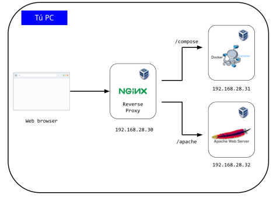
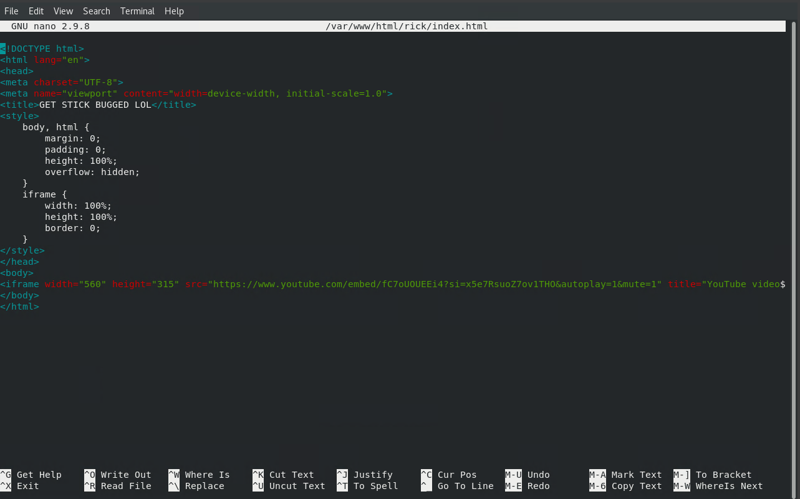
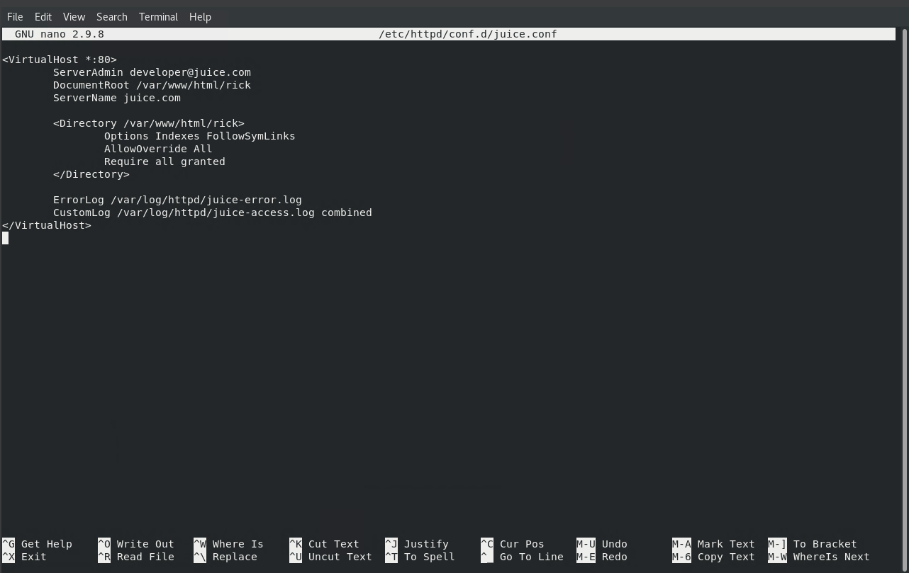
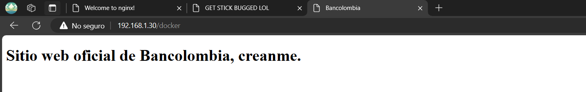
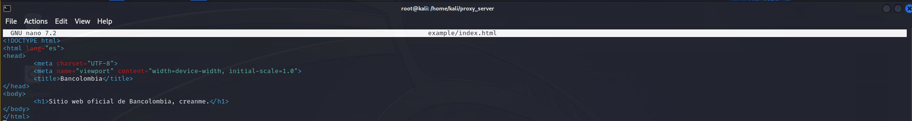
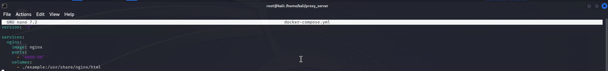
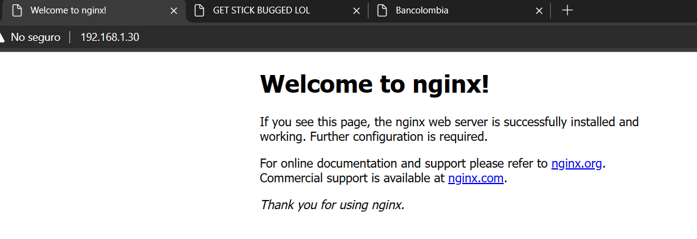
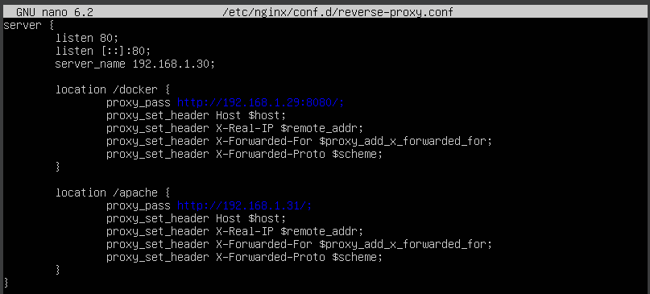
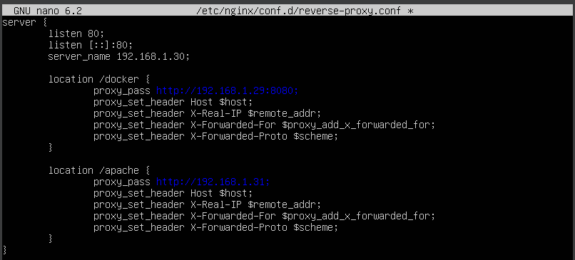
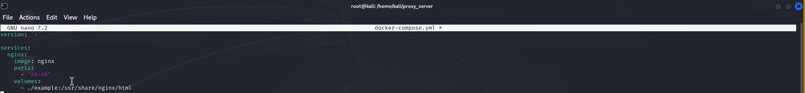

Actividad 3 Sistemas Operativos

Juan Esteban Becerra Gutiérrez

Alejandro Sarmiento Rivera

José Daniel Ramirez Delgado

Facultad de ingeniería de sistemas y computación

Sistemas Operativos

Pontificia Universidad Javeriana Cali 2024-1

> **Descripción del ejercicio:**
>
> En este ejercicio, el/la estudiante llevará a cabo el despliegue de un
> ambiente computacional distribuido. En este caso el/la estudiante hará
> del despliegue de los servicios representados en la figura de abajo.
>
>  style="width:6.26772in;height:4.69444in" />Esta figura ilustra al
> menos 5 elementos:
>
> ● Tú PC
>
> ● Un web browser o navegador
>
> ● Un proxy inverso (IP: 192.168.28.30 y ejecutándose sobre una máquina
> virtual)
>
> ● Un aplicativo ejecutado con la herramienta ‘docker-compose’ (IP:
> 192.168.28.31 y ejecutándose sobre una máquina virtual)
>
> ● Un servidor web Apache (IP: 192.168.28.32 y ejecutándose sobre una
> máquina virtual)
>
> Usted ya cuenta con dos elementos de los mencionados anteriormente,
> Tú PC y el web browser y también ya sabe
> crear máquinas virtuales. Entonces, usted se debe encargar de hacer el
> despliegue (instalación y configuración) de los otros elementos en
> máquinas virtuales a saber: proxy inverso, máquina virtual ejecutando
> ‘docker-compose’ y servidor web Apache.
>
> **Implementación:**
>
> Al requerir de la ejecución de tres máquinas virtuales al mismo tiempo
> dentro de un solo computador (y no morir en el intento), fue
> fundamental elegir distribuciones de Linux que juntas no requieran de
> muchos recursos y que puedan cumplir con su función. Al ser el
> servidor de proxy inverso el que requería menos recursos, se optó por
> utilizar la distribución Ubuntu Server ya que es la más ligera que se
> conoce y la que tiene una sintaxis no tan complicada de interpretar.
> Por otra parte, se hizo uso de la distribución CentOS 7 para el
> servidor Apache ya que, desde el semestre pasado, se tenía una máquina
> virtual con Apache instalado y configurado. Por último, se hizo uso de
> la distribución Kali Linux para poder implementar Docker Compose ya
> que es una distribución bastante sencilla y con una interfaz gráfica
> bastante amigable para el usuario, lo que hacía más fácil poder
> configurar algo un poco complejo como lo es Docker Compose. A
> continuación, se explicará brevemente el paso a paso de la
> configuración de cada una de las máquinas virtuales para que pudieran
> funcionar y comunicarse entre sí:

1.  **Servidor web de Apache**

> En la primera máquina virtual (CentOS), se optó por usar un sitio web
> que contiene un video de broma con dirección IP 192.168.1.31 (Entorno
> trabajado por direccionamiento dinámico), pero con el proxy inverso se
> llama a 192.168.1.30/apache (Entorno trabajado por direccionamiento
> dinámico). style="width:6.26772in;height:1.13889in" />

Figura 1: Vista previa del resultado final al entrar al servicio de
Apache.

Principalmente, la instalación del servicio se realizó con el siguiente
comando:

*sudo apt install httpd*

Luego, se configuró el sitio web dentro de la carpeta estándar de Apache
para alojar los sitios web:

*/var/www/html/rick*

Siendo *rick* el nombre de la carpeta donde se guardó el html (Ver
Figura 2).

Figura 2: Código Html del sitio web en el servicio de Apache.

Por último, se guardó el archivo de configuración del VirtualHost para
que Apache pudiera resolver el sitio web requerido por el puerto
estándar del protocolo HTTP (80) en la carpeta estándar de Apache para
alojar Hosts virtuales:

*/etc/httpd/conf.d*

De esta manera se tiene el archivo de configuración (Ver Figura 3).

Figura 3: Archivo de configuración para el direccionamiento del sitio
web.

2.  **Servidor web de Docker Compose**

En la segunda máquina virtual (Kali Linux) se creó un sitio web de
prueba siendo la máquina con IP 192.168.1.29 (Entorno trabajado por
direccionamiento dinámico), pero con el reverse proxy se llama a
192.168.1.30/docker (Entorno trabajado por direccionamiento dinámico).

Figura 4: Vista previa del resultado final al entrar al servicio de
Docker Compose.

Principalmente, la instalación del servicio se realizó con los
siguientes comandos:

*sudo apt-get install docker.io*

*sudo systemctl start docker*

*sudo systemctl enable docker*

*sudo apt-get install docker-compose*

Luego, se configuró el sitio web dentro de una carpeta arbitraria:

*/home/kali/proxy_server/example*

Siendo *example* el nombre de la carpeta donde se guardó el html (Ver
Figura 2).

Figura 5: Código Html del sitio web en el servicio de Docker Compose.

Por último, en la misma carpeta arbitraria se guardó el
*docker-compose.yml* que contiene la configuración del contenedor
utilizado y su direccionamiento para que funcione con el servicio de
Nginx (Ver Figura 6).

Figura 6: Configuración del contenedor que permite la ejecución del
servicio web.

3.  **Servidor de Proxy Inverso con Nginx:**

En la última máquina virtual (Ubuntu Server), se usó como el servidor
con nginx que hace el reverse proxy de las solicitudes de los 2
servidores web, que hacen el llamado a la IP 192.168.1.30 (Entorno
trabajado por direccionamiento dinámico)

Figura 7: Vista previa del resultado final al entrar al servicio de
Proxy Inverso.

Principalmente, la instalación del servicio se realizó con el siguiente
comando:

*sudo apt install nginx*

En realidad, el proxy no tiene un sitio web en particular ya que su
objetivo principal es direccionar hacia las otras máquinas virtuales y
sus respectivos servicios. De esta manera, se tiene la configuración del
proxy inverso dentro de la carpeta estándar de Nginx para alojar las
configuraciones de sus servicios:

*/etc/nginx/conf.d*

Dejando así el archivo *reverse-proxy.conf* (Ver Figura 8).

Figura 8: Configuración del direccionamiento de solicitudes en el proxy
inverso.

**Dificultades en el desarrollo:**

1.  **Redireccionamiento:** Al principio, el proxy inverso no funcionaba
    correctamente ya que, cuando se realizaba el llamado a los servicios
    redireccionados, la máquina indicaba que o bien las URL’s no
    existían o no se podían cargar los recursos (Ver Figura 9). Se
    soluciona el problema insertando un ‘/’ al final de las referencias
    a las direcciones de cada uno de los servicios en el ‘proxy_pass’
    (Ver Figura 8).

Figura 9: Configuración inicial del proxy inverso que generaba
conflicto.

Se cree que sucedía esto debido a que el proxy inverso sí realizaba el
direccionamiento, pero al no tener ese ‘/’ al final de la dirección, no
se le estaba dando la órden de cargar todos los recursos que se
encuentran dentro de las máquinas virtuales objetivo. Aunque esto no
tiene mucho sentido de manera teórica, en lo práctico se tenía que
implementar porque sino no funcionaba.

2.  **Implementación de contenedores en Docker Compose:** Al principio
    no se tenía muy claro cuál era el objetivo de la implementación de
    Docker Compose ni cuál debería ser el resultado esperado al
    implementarlo. Se asumió que se buscaba crear un contenedor que
    sirviera como servidor web usando Nginx. No obstante, se tuvo un
    problema a la hora de asignar los puertos para que se resolviera el
    contenedor. Se esperaba utilizar el puerto predeterminado para el
    protocolo HTTP (80) con el objetivo de resolver el sitio web creado
    (Ver Figura 10). Sin embargo, al hacer el llamado a la máquina
    virtual, mostraba el sitio web por defecto que trae Nginx. La
    solución más viable fue utilizar un puerto distinto (en este caso
    el 8080) y resolver las conexiones entrantes y salientes por ese
    puerto por el protocolo HTTP (Ver Figura 6).

Figura 10: Configuración inicial del docker compose que generaba
conflicto.

Esto iría acompañado con el Proxy Inverso, donde tocó cambiar el puerto
referenciado en el ‘proxy_pass’ al que utiliza el contenedor
implementado (Ver Figura N).

3.  **Conexión entre las máquinas:** Inicialmente, se quería conectar
    las máquinas dentro de una red NAT generada dentro de VirtualBox
    para tener un entorno aislado y que se pudieran guardar con mayor
    facilidad las IP 's de cada una de las máquinas virtuales. Sin
    embargo, el problema principal era lograr que el computador que
    ejecutaba las máquinas pudiera comunicarse con ellas. Si bien
    existía el redireccionamiento de puertos existía para que se
    pudieran comunicar, no era práctico ya que, al haber
    redireccionamientos, se pasaban a las IP ‘s dentro de la red NAT y
    el computador principal no podía resolverlas. La solución más
    sencilla fue utilizar adaptadores puentes para que todas las
    máquinas virtuales se encontraran dentro del mismo entorno de red
    que el computador principal. No obstante, esto hace que el
    laboratorio no sea portable, ya que las máquinas tienen sus IP ‘s
    asignadas por protocolo DHCP y, si se cambia el entorno de red, se
    requerirá modificar la configuración del proxy inverso para que
    pueda redireccionar hacia las otras máquinas con las nuevas
    direcciones IP que le fueron asignadas.

**Referencias Bibliográficas:**

\[1\] [<u>https://chat.openai.com</u>](https://chat.openai.com).

\[2\] LinuxHelp. (2021, 3 septiembre). *How to install and configure
Apache Web Server in CentOS 7* \[Vídeo\]. YouTube.
[<u>https://www.youtube.com/watch?v=tOVLav3kTSQ</u>](https://www.youtube.com/watch?v=tOVLav3kTSQ).

\[3\] NetworkChuck. (2022, 31 agosto). *Docker Compose will BLOW your
MIND!! (a tutorial)* \[Vídeo\]. YouTube.
[<u>https://www.youtube.com/watch?v=DM65_JyGxCo</u>](https://www.youtube.com/watch?v=DM65_JyGxCo).

\[4\] NGINX. (2021, 8 junio). *Configure NGINX as a Reverse Proxy*
\[Vídeo\]. YouTube.
[<u>https://www.youtube.com/watch?v=lZVAI3PqgHc</u>](https://www.youtube.com/watch?v=lZVAI3PqgHc).
